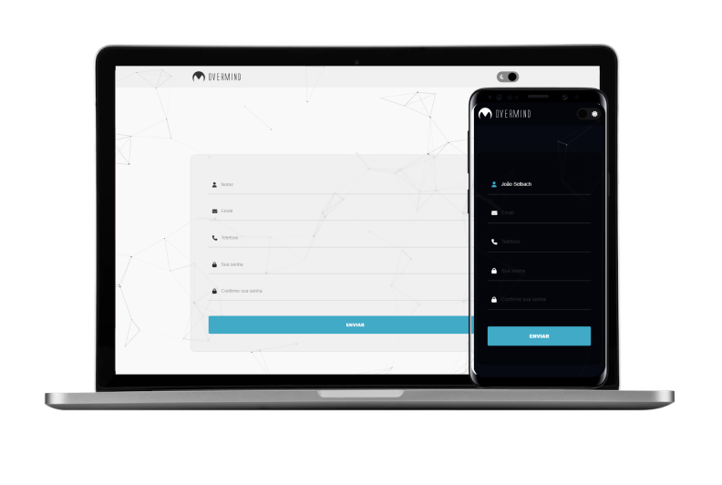

<h1 align="center">
    
</h1>

  <a href="#-tecnologias">Tecnologias</a>&nbsp;&nbsp;&nbsp;|&nbsp;&nbsp;&nbsp;
  <a href="#-projeto">Projeto</a>&nbsp;&nbsp;&nbsp;|&nbsp;&nbsp;&nbsp;

 

## 🚀 Tecnologias

Esse projeto foi desenvolvido com as seguintes tecnologias:

- [HTML5]
- [Css]
- [Javascript]

## 💻 Projeto

- Todos os inputs tem validação
- Quando o input é validado o icone fica com a cor azul
- Não é possivel dar submit sem todos os inputs serem validados
- Após o submit todos os dados preenchidos no formulário serão enviados para o email previamente colocado no SMTP
- Dark/Light mode
- Background animado com interação hover/click
- Animação Lottie (Necessário rodar em live server para funcionar)

